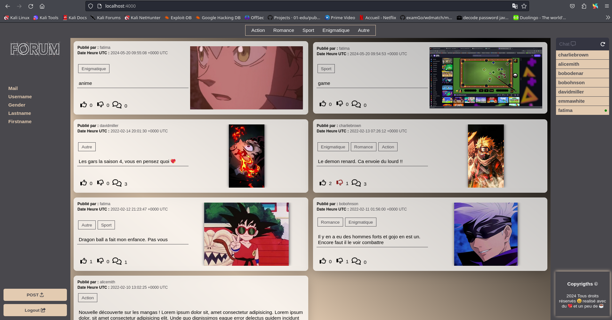

# 💬 Real-Time Forum

A modern, interactive web forum built with Go and JavaScript featuring real-time messaging capabilities through WebSockets. This project demonstrates full-stack development skills with a focus on concurrent programming and real-time communication.

## 🎯 Project Overview

This real-time forum is a complete web application that enables users to create posts, comment, interact through likes/dislikes, and communicate via private messages in real-time. Built as a Single Page Application (SPA), it showcases modern web development practices and architecture.

## ✨ Key Features

### 👤 User Authentication & Management
- **Complete Registration System** with comprehensive user profiles:
  - Nickname, Age, Gender
  - First Name, Last Name
  - Email and secure password storage
- **Flexible Login**: Users can authenticate using either nickname or email
- **Session Management**: Secure session handling with logout functionality from any page
- **Password Encryption**: Using bcrypt for secure password hashing

### 📝 Posts & Comments
- Create posts with multiple category associations
- Comment on posts with nested display
- Feed-based post display for easy browsing
- Click-to-expand post details with full comment thread

### 👍 Interactive Features
- Like and dislike posts
- Like and dislike comments
- Post filtering by categories
- Real-time interaction updates

### 💬 Real-Time Private Messaging
- **WebSocket-based chat** for instant communication
- **Online/offline status** indicators
- **Smart chat organization**: Sorted by last message or alphabetically
- **Message history**: Display last 10 messages with scroll-to-load-more
- **Message metadata**: Timestamps and sender information
- **Real-time notifications**: Instant message delivery

## 🛠️ Technical Stack

### Backend - Go (Golang)
- **HTTP Server**: Native Go HTTP handlers
- **WebSockets**: Real-time bidirectional communication using Gorilla WebSocket
- **Database**: SQLite3 with migration system
- **Authentication**: Secure session management with UUID
- **Password Security**: bcrypt encryption (golang.org/x/crypto)
- **Routing**: Custom handler functions for different endpoints

### Frontend - JavaScript
- **Single Page Application (SPA)**: Dynamic content loading without page refresh
- **WebSocket Client**: Real-time message handling
- **Event-Driven Architecture**: Asynchronous user interactions
- **DOM Manipulation**: Dynamic UI updates

### Database
- **SQLite3**: Lightweight, embedded database
- **Migration System**: Structured schema management
- Efficient queries for posts, comments, messages, and user data

### Styling
- **HTML5**: Semantic markup
- **CSS3**: Modern, responsive design

## 🚀 Getting Started

### Prerequisites
- Go 1.22.0 or higher
- SQLite3

### Installation & Running

1. **Clone the repository**
```bash
git clone https://github.com/mamadbah2/real-time-forum.git
cd real-time-forum
```

2. **Install dependencies**
```bash
go mod download
```

3. **Run the application**
```bash
go run ./cmd/web/.
```

4. **Access the forum**
Open your browser and navigate to `http://localhost:8080`

### Docker Deployment

Run with Docker for containerized deployment:
```bash
./Run_docker.sh
```

Or manually:
```bash
docker build -t real-time-forum .
docker run -p 8080:8080 real-time-forum
```

## 📁 Project Structure

```
real-time-forum/
├── cmd/
│   └── web/              # Application entry point, handlers, and server setup
├── db/                   # Database files and migration scripts
├── internal/             # Internal packages for business logic
│   ├── models/           # Data models and database operations
│   └── handlers/         # Request handlers
├── ui/
│   ├── static/           # CSS, JavaScript, and images
│   │   ├── css/          # Stylesheets
│   │   ├── js/           # JavaScript files (SPA logic, WebSocket client)
│   │   └── img/          # Images and uploads
│   └── html/             # HTML templates
├── Dockerfile            # Docker configuration
├── go.mod                # Go module dependencies
└── README.md
```

## 🎓 Skills Acquired

### Backend Development
- ✅ **Go Programming**: Mastery of Go syntax, goroutines, and concurrency patterns
- ✅ **HTTP Server Development**: Building RESTful APIs and handling HTTP requests/responses
- ✅ **WebSocket Implementation**: Real-time bidirectional communication
- ✅ **Database Management**: SQLite integration, schema design, and SQL queries
- ✅ **Session Management**: User authentication, cookie handling, and security
- ✅ **Cryptography**: Password hashing and secure data storage
- ✅ **Error Handling**: Robust error management and logging

### Frontend Development
- ✅ **JavaScript ES6+**: Modern JavaScript features and best practices
- ✅ **Single Page Application (SPA)**: Dynamic content rendering without page reloads
- ✅ **WebSocket Client**: Real-time data handling and UI updates
- ✅ **Event-Driven Programming**: Asynchronous operations and event listeners
- ✅ **DOM Manipulation**: Dynamic HTML generation and interaction
- ✅ **Responsive Design**: CSS layout and mobile-friendly interfaces

### Software Architecture
- ✅ **MVC Pattern**: Separation of concerns (Models, Views, Controllers)
- ✅ **Project Organization**: Clean code structure and modular design
- ✅ **API Design**: RESTful endpoints and WebSocket protocols
- ✅ **State Management**: Client and server state synchronization

### DevOps & Tools
- ✅ **Docker**: Containerization and deployment
- ✅ **Git Version Control**: Collaborative development workflow
- ✅ **Dependency Management**: Go modules
- ✅ **Database Migrations**: Schema versioning and updates

### Soft Skills
- ✅ **Problem Solving**: Debugging complex real-time systems
- ✅ **Full-Stack Development**: End-to-end feature implementation
- ✅ **Code Documentation**: Writing clear, maintainable code
- ✅ **Team Collaboration**: Working with multiple developers
- ✅ **Project Planning**: Task management and feature prioritization

## 🔧 Key Technical Achievements

1. **Real-Time Communication**: Implemented WebSocket protocol for instant messaging
2. **Concurrent Programming**: Handled multiple simultaneous user connections
3. **Security**: Implemented secure authentication and session management
4. **Database Design**: Created normalized schema with efficient relationships
5. **SPA Architecture**: Built dynamic user interface without page reloads
6. **Dockerization**: Containerized application for easy deployment

## 📸 Screenshots



## 👥 Authors

- [mamadbah](https://learn.zone01dakar.sn/git/mamadbah)
- [belhadjs](https://learn.zone01dakar.sn/git/belhadjs)

## 🤝 Contributing

This project was developed as part of the Zone01 Dakar curriculum. Feel free to fork and build upon it!

## 📝 License

This project is open source and available for educational purposes.

---

**Built with ❤️ at Zone01 Dakar**
